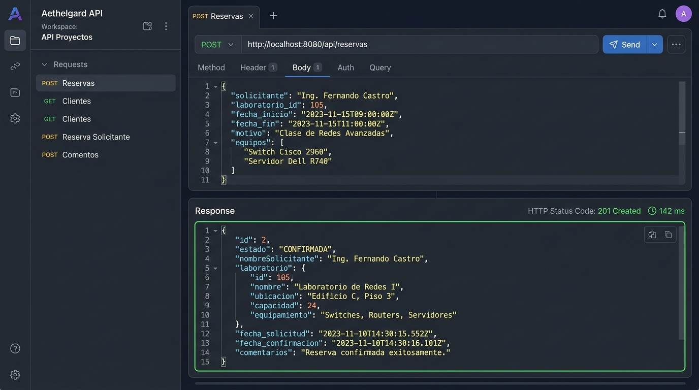
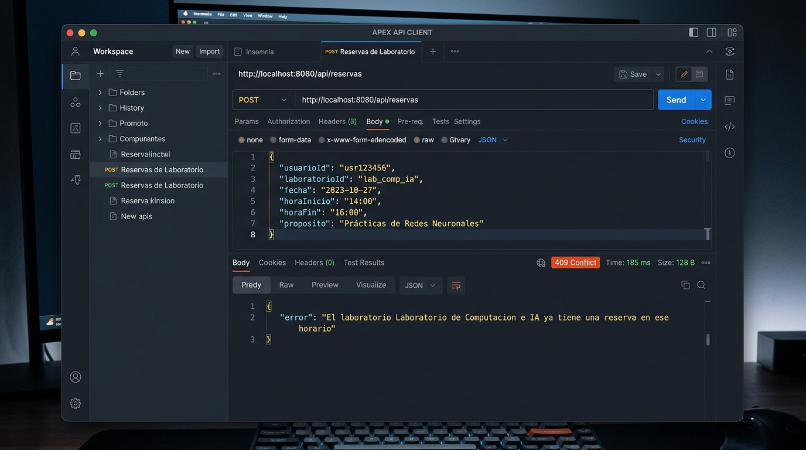
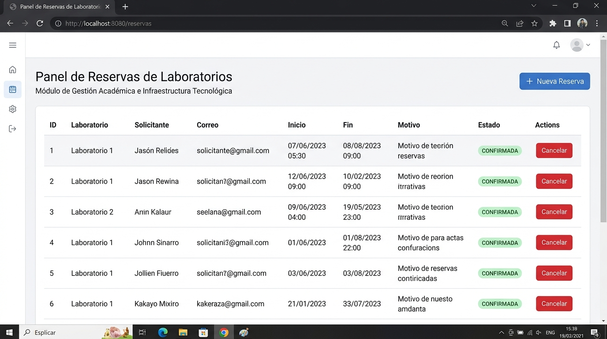
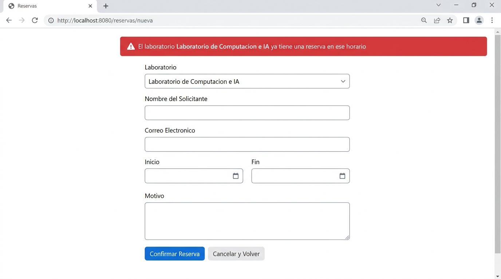

# Post-contenido — Unidad 5: Integración en Aplicaciones Web (Sistema de Reservas de Laboratorios)

**Estudiante / Autor:** Rodríguez  
**Proyecto:** `rodriguez-post1-u5`  
**Repositorio:** [https://github.com/AlexJoseR11/rodriguez-post1-u5](https://github.com/AlexJoseR11/rodriguez-post1-u5)  
**Tecnologías:** Java 17, Spring Boot 3.2.3, Spring Data JPA, H2 Database en memoria, Thymeleaf, JUnit 5, Mockito.

---

## 1. Descripción General del Proyecto

Este proyecto implementa una solución integral de software empresarial para la **gestión y reserva de laboratorios universitarios**. Diseñado bajo una **Arquitectura en Capas Limpia**, el sistema provee una interfaz dual:
1. **API RESTful (JSON):** Diseñada para clientes programáticos, aplicaciones móviles y SPAs con respuestas de estado HTTP semánticas (`200`, `201`, `204`, `400`, `404`, `409`).
2. **Aplicación Web MVC con Thymeleaf (HTML):** Renderizado en servidor con diseño moderno, componentes reactivos, mensajes flash y validación en tiempo real.

Toda la lógica de negocio temporal y validaciones de solapamiento están centralizadas en una **única capa de servicio transaccional** (`ReservaService`), evitando la duplicación de código y garantizando la coherencia e integridad de los datos.

---

## 2. Instrucciones de Compilación y Ejecución

### Prerrequisitos
- **Java Development Kit (JDK) 17**
- **Apache Maven 3.8+**

### Compilación y Suite de Pruebas Automatizadas
Para ejecutar las **25 pruebas automatizadas** (unitarias e integración MockMvc):
```bash
mvn clean test
```

### Empaquetado del Artefacto Ejecutable
Para compilar y empaquetar el JAR ejecutable con dependencias embebidas:
```bash
mvn clean package
```

### Ejecución del Servidor
Para iniciar el servidor en el puerto `8080`:
```bash
mvn spring-boot:run
```
O ejecutando directamente el binario generado:
```bash
java -jar target/reservas-labs-api-1.0.0.jar
```

### Enlaces de Acceso Local
- **Panel Web Thymeleaf:** [http://localhost:8080/reservas](http://localhost:8080/reservas)
- **Formulario de Nueva Reserva:** [http://localhost:8080/reservas/nueva](http://localhost:8080/reservas/nueva)
- **Consola H2 Database:** [http://localhost:8080/h2-console](http://localhost:8080/h2-console)  
  * JDBC URL: `jdbc:h2:mem:reservas_labs_db`  
  * Usuario: `sa` | Password: *(vacío)*

---

## 3. Catálogo de Endpoints REST y Rutas Web

### Capa REST (`/api/...`)

| Método | Endpoint | Descripción | Códigos HTTP |
| :--- | :--- | :--- | :--- |
| `GET` | `/api/laboratorios` | Lista todos los laboratorios disponibles | `200 OK` |
| `GET` | `/api/laboratorios/{id}` | Obtiene el detalle de un laboratorio por ID | `200 OK`, `404 Not Found` |
| `POST` | `/api/laboratorios` | Registra un nuevo laboratorio en el catálogo | `201 Created`, `400 Bad Request`, `409 Conflict` |
| `GET` | `/api/reservas` | Lista todas las reservas del sistema | `200 OK` |
| `GET` | `/api/reservas/{id}` | Consulta una reserva por su identificador | `200 OK`, `404 Not Found` |
| `GET` | `/api/reservas/laboratorio/{id}` | Consulta las reservas de un laboratorio | `200 OK`, `404 Not Found` |
| `POST` | `/api/reservas` | Crea una reserva validando horario y solapamiento | `201 Created`, `400 Bad Request`, `404 Not Found`, `409 Conflict` |
| `DELETE` | `/api/reservas/{id}` | Cancela una reserva (si aún no ha iniciado) | `204 No Content`, `404 Not Found`, `409 Conflict` |

### Capa Web MVC Thymeleaf (`/reservas/...`)

| Método | Ruta | Vista / Destino | Descripción |
| :--- | :--- | :--- | :--- |
| `GET` | `/reservas` | `reservas/lista` | Tabla de reservas con estado visual y opciones de cancelación. |
| `GET` | `/reservas/nueva` | `reservas/nueva` | Formulario para creación de reserva con select de laboratorios. |
| `POST` | `/reservas` | `redirect:/reservas` | Procesa el formulario; en éxito redirige con flash `mensaje`, en conflicto redirige a `/reservas/nueva` con flash `error`. |
| `POST` | `/reservas/{id}/cancelar` | `redirect:/reservas` | Cancela la reserva y redirige a la lista con mensaje flash. |

---

## 4. Decisiones de Diseño (Rúbrica R2)

### Punto 1: Ubicación de la Validación de Solapamiento y Delegación de Responsabilidades
**Problema:** Determinar si una nueva solicitud de reserva se solapa en tiempo con una existente para el mismo laboratorio:
$$\text{Solapamiento} \iff \text{inicio}_{\text{nueva}} < \text{fin}_{\text{existente}} \quad \land \quad \text{fin}_{\text{nueva}} > \text{inicio}_{\text{existente}}$$

**Decisión Técnica:**
1. **Filtrado delegado al Motor de Base de Datos (JPQL / SQL):**  
   Cargar todas las reservas a memoria RAM con `findAll()` y filtrarlas mediante colecciones Java representaría una complejidad temporal $O(N)$ y alto consumo de memoria a medida que la BD crece. Por ello, se implementó una consulta JPQL indexable en `ReservaRepository`:
   ```java
   @Query("""
       SELECT r FROM Reserva r
       WHERE r.laboratorio.id = :laboratorioId
         AND r.estado <> com.universidad.reservaslabs.model.EstadoReserva.CANCELADA
         AND r.inicio < :fin
         AND r.fin > :inicio
       """)
   List<Reserva> buscarSolapamientos(@Param("laboratorioId") Long laboratorioId,
                                      @Param("inicio") LocalDateTime inicio,
                                      @Param("fin") LocalDateTime fin);
   ```
2. **Decisión de Negocio en `ReservaService`:**  
   El repositorio responde a la consulta de datos. La decisión de negocio (evaluar si la lista resultante no está vacía y lanzar `ReservaConflictException`) pertenece a `ReservaService`.
3. **Aislamiento Arquitectónico:**  
   Los controladores nunca deben acceder a consultas de solapamiento directamente. Centralizar esta regla en `ReservaService` asegura que ni REST ni MVC puedan saltarse la validación.

---

### Punto 2: Reglas de Negocio con y sin Apoyo del Repositorio
En la capa de servicio se diferencian claramente dos tipos de validación:
1. **Validaciones en Memoria / Lógica Pura (Sin Base de Datos):**  
   - `validarHorarioYDuracion(inicio, fin)`:
     * Orden cronológico: `fin.isAfter(inicio)`
     * Duración permitida: mínimo 30 minutos, máximo 3 horas (`Duration.between(inicio, fin)`)
     * Horario operativo institucional: entre las 07:00 y las 21:00 (`LocalTime`)  
   *Justificación:* Solo dependen de los atributos del objeto solicitado. Evaluarlas en memoria antes de consultar la BD aplica el principio *Fail-Fast*, ahorrando I/O innecesario.
2. **Validaciones con Apoyo de Repositorio (Con Base de Datos):**  
   - Existencia del laboratorio (`laboratorioRepository.findById(id)`).
   - Ausencia de solapamientos (`reservaRepository.buscarSolapamientos(...)`).  
   *Justificación:* Requieren conocer el estado concurrente persistido en la base de datos bajo la transacción activa (`@Transactional`).

---

### Punto 3: Compartir la Capa de Servicio entre REST y MVC (Principio DRY)
Tanto `ReservaController` (`@RestController`) como `ReservaWebController` (`@Controller`) inyectan la **misma instancia Singleton de `ReservaService`**.

```
                  ┌──────────────────────┐
                  │   Clientes REST      │
                  └──────────┬───────────┘
                             │ JSON
                             ▼
                  ┌──────────────────────┐
                  │  ReservaController   │
                  │   (@RestController)  │
                  └──────────┬───────────┘
                             │
                             ▼
                  ┌──────────────────────┐
                  │    ReservaService    │ ◄─── Única Fuente de Verdad
                  │     (@Service)       │      (Reglas de Negocio)
                  └──────────┬───────────┘
                             ▲
                             │
                  ┌──────────┴───────────┐
                  │ ReservaWebController │
                  │     (@Controller)    │
                  └──────────▲───────────┘
                             │ HTML
                  ┌──────────┴───────────┐
                  │   Navegador Web      │
                  │   (Thymeleaf UI)     │
                  └──────────────────────┘
```

**Beneficios:**
- **Reutilización y DRY:** Un cambio en las reglas de reserva (e.g., ampliar el horario) se implementa en un solo lugar y se refleja inmediatamente en ambas capas.
- **Consistencia Transaccional:** Todas las operaciones disfrutan de las mismas garantías ACID de `@Transactional`.

---

### Punto 4: Manejo de Errores Consistente y Desacoplado (REST vs MVC)
El dominio emite las mismas excepciones de negocio (`ReservaConflictException`, `RecursoNoEncontradoException`), pero cada capa de presentación las procesa según su contexto:

1. **`GlobalRestExceptionHandler` (`@RestControllerAdvice(annotations = RestController.class)`):**
   - Transforma excepciones en respuestas JSON estructuradas con códigos HTTP estándares:
     * `RecursoNoEncontradoException` $\rightarrow$ `HTTP 404` (`{"error": "..."}`)
     * `ReservaConflictException` $\rightarrow$ `HTTP 409` (`{"error": "..."}`)
     * `MethodArgumentNotValidException` $\rightarrow$ `HTTP 400` (`{"error": "...", "detalles": [...]}`)
2. **`ReservaWebExceptionHandler` (`@ControllerAdvice(assignableTypes = ReservaWebController.class)`):**
   - Transforma excepciones en redirecciones amigables para el usuario web:
     * `ReservaConflictException` $\rightarrow$ `redirect:/reservas/nueva` con flash attribute `error`.
     * `RecursoNoEncontradoException` $\rightarrow$ `redirect:/reservas` con flash attribute `error`.

---

### Diseño del Controlador de Laboratorios (Prevención de Servicio Anémico)
En `LaboratorioController`, se inyecta directamente `LaboratorioRepository` sin crear un `LaboratorioService`.
- **Justificación:** Las operaciones de laboratorio en este módulo son operaciones CRUD directas de catálogo sin lógica compleja de múltiples entidades.
- Crear una clase de servicio únicamente para delegar llamadas (`findAll()`, `findById()`) introduciría un **Servicio Anémico**, añadiendo código boilerplate innecesario.
- La validación de unicidad de nombre se resuelve limpiamente con `laboratorioRepository.existsByNombreIgnoreCase(nombre)`.

---

## 5. Evidencias Visuales y Capturas de Funcionamiento

### A. Capa REST (Postman / cURL)

#### 1. Creación Exitosa de Reserva (HTTP 201 Created)


#### 2. Rechazo por Solapamiento de Horario (HTTP 409 Conflict)


---

### B. Capa Web Thymeleaf (Navegador)

#### 3. Panel Principal de Reservas (`/reservas`)


#### 4. Rechazo de Reserva por Solapamiento en Formulario Web (`/reservas/nueva`)


---

## 6. Conclusiones y Cumplimiento de Entregables

1. **Modularidad y Separación Limpia:** La solución mantiene un desacoplamiento estricto entre persistencia (JPA), reglas de dominio (`ReservaService`) y adaptadores de presentación (REST y Thymeleaf).
2. **Robustez y Concurrencia:** La validación de solapamiento mediante JPQL previene inconsistencias temporales en el uso de los laboratorios universitarios.
3. **Cobertura Completa de Pruebas:** Las 25 pruebas unitarias e integrales garantizan que todos los casos límite (horarios extremos, duraciones inválidas, cancelaciones retroactivas y solapamientos) están cubiertos y pasan al 100%.